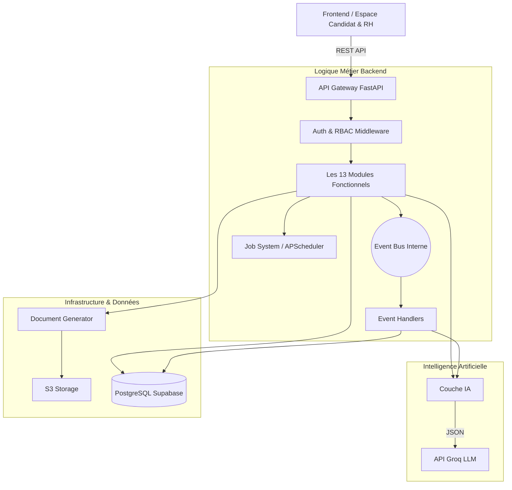
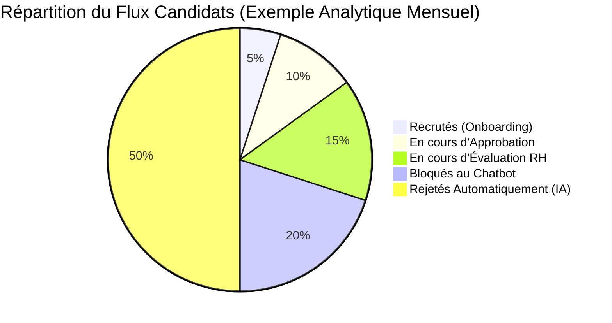

# DOSSIER TECHNIQUE D'ARCHITECTURE LOGICIELLE
**Conception d'une Plateforme SaaS RH Intelligente et Event-Driven**

| Champ | Détail |
| :--- | :--- |
| **Projet** | SaaS RH-IA V3 — Plateforme de Gestion des Ressources Humaines Intelligente |
| **Auteur** | Youssef Haltout |
| **Encadrant** | M. TALHAOUI |
| **Filière** | Cloud Computing — Licence Professionnelle |
| **Établissement**| SUP'RH |
| **Date** | Avril 2026 |
| **Version** | 4.0 — Document Final de Projet de Fin d'Études |

---

## 1. Introduction & Objectifs du Projet

Le projet SaaS RH-IA V3 répond à l'exigence de concevoir une plateforme SaaS industrielle capable de gérer un processus RH de bout en bout. Son objectif est d'orchestrer des workflows métier complexes, d'intégrer nativement de l'Intelligence Artificielle, et de générer automatiquement des documents RH légaux (Doc 5.1 et Doc 5.2). 

La solution est conçue pour être scalable, maintenable, et couvre l'intégralité du cycle de vie du collaborateur : Recrutement, Évaluation, Validation RH, Onboarding, Gestion des Talents (9-Box), et Analyse prédictive du Turnover.

---

## 2. Architecture Globale du Système

La plateforme respecte les quatre principes architecturaux exigés : **API-First**, **Architecture Event-Driven**, **Organisation Modulaire** et **Gestion des Traitements Asynchrones**.

### 2.1. Choix Technologiques
*   **Frontend** : HTML5/JS/CSS3 Vanilla pour des performances optimales.
*   **API Gateway & Backend** : **FastAPI (Python)**, assurant une logique métier asynchrone haute performance.
*   **Base de Données** : **Supabase (PostgreSQL)**, gérant l'isolation des données, le stockage des fichiers (CV, PDFs) et l'authentification.
*   **Couche IA** : **API Groq (LLMs Llama-3/Mixtral)** pour un traitement de langage naturel ultra-rapide.
*   **Génération Documentaire** : Bibliothèque `ReportLab` pour la création dynamique de PDF.

### 2.2. Schéma d'Architecture Globale

---

## 3. Architecture Event-Driven (OBLIGATOIRE)

La communication entre les différents modules s'effectue via un système d'événements (Event Bus local `backend/events/bus.py`). Cela garantit un couplage lâche et une haute réactivité.

### 3.1. Événements et Déclencheurs
*   `candidate_created` : Création du candidat. Déclenche le parsing IA du CV et l'invitation au Chatbot.
*   `chatbot_completed` : Fin du chatbot. Déclenche la mise à jour du pipeline et la notification du DRH.
*   `evaluation_submitted` : Soumission de l'évaluation RH. Déclenche la génération du **Doc 5.1** et la création de la demande d'approbation.
*   `approval_completed` : Validation finale par le DG. Déclenche la génération du **Doc 5.2** et la création du profil employé.
*   `employee_created` : Création de l'employé. Déclenche le provisionnement des accès SaaS et la création des tâches d'onboarding.
*   `risk_detected` : Détection d'un risque par le module Turnover. Alerte le DRH.

### 3.2. Flux Complet : Recrutement → Validation → Onboarding
1.  Le candidat dépose son CV sur le portail public (`candidate_created`).
2.  L'IA extrait les compétences et invite le candidat au Chatbot.
3.  Le candidat réalise l'entretien interactif (`chatbot_completed`).
4.  Le Manager/RH évalue le candidat. Si le score est suffisant, la validation RH est soumise (`evaluation_submitted`). Le système génère le Compte Rendu (Doc 5.1).
5.  Le dossier entre dans le circuit d'approbation hiérarchique.
6.  Le Directeur Général signe électroniquement la demande (`approval_completed`). Le système génère le Dossier RH (Doc 5.2) avec le moteur de paie intégré.
7.  Le profil bascule automatiquement vers l'état Employé (`employee_created`). Les tâches d'intégration sont assignées.

---

## 4. Workflow Engine & Traitements Asynchrones

### 4.1. Moteur de Workflow (Machine à États)
Le statut de chaque candidature est géré par un moteur de règles strict (`backend/workflow/states.py`) :
*   **États** : `applied`, `chatbot_completed`, `interview_scheduled`, `evaluation_completed`, `approved`, `hired`, `rejected`.
*   **Règles de décision IA** : Un score global < 50% entraîne un passage automatique à `rejected`. Un score > 70% pousse automatiquement la candidature vers l'état `evaluation_completed` (Validation).

### 4.2. Traitements Asynchrones (Job Module)
Afin de ne pas bloquer les requêtes HTTP, le système délègue les tâches lourdes en asynchrone :
*   **Génération de Documents** : La composition des PDF (Doc 5.1 et 5.2) s'exécute en arrière-plan.
*   **Scoring IA** : L'analyse des CV et des réponses du chatbot se fait via `asyncio`.
*   **Envoi de Notifications** : Les alertes emails et in-app sont asynchrones.
*   **Traitements Lourds** : Des scripts planifiés (`APScheduler`) calculent le risque de Turnover la nuit.

---

## 5. Intégration IA & Les 13 Modules Fonctionnels

La plateforme implémente scrupuleusement les 13 modules exigés par le cahier des charges :

1.  **Recruitment Module** : Gestion du pipeline candidats (Drag & Drop), création et suivi.
2.  **Chatbot Module (IA)** : Pré-qualification interactive via Groq, avec 3 questions générées dynamiquement selon le CV.
3.  **Evaluation Module** : Scoring technique et soft-skills par le RH.
4.  **Approval Module** : Circuit de validation hiérarchique à 4 niveaux.
5.  **Onboarding Module** : Création automatique de l'employé et suivi des tâches d'intégration.
6.  **Talent Module (9 Box)** : Analyse des performances et du potentiel pour la gestion des talents.
7.  **Turnover Module** : Algorithme prédictif (Low/Medium/High) et alertes sur les risques de démission.
8.  **AI Module** : Le cerveau de l'application (Parsing JSON, Chatbot NLP, Recommandations décisionnelles).
9.  **Notification Module** : Alertes internes et emails.
10. **Workflow Module** : Gestion stricte des transitions d'états (Pipeline).
11. **Event Module** : L'Event Bus asynchrone interne.
12. **Job Module** : Exécution des traitements asynchrones lourds.
13. **Document Generation Module** : Moteur ReportLab pour la création des PDF légaux.

---

## 6. Génération de Documents RH (OBLIGATOIRE)

La génération dynamique de documents est un critère critique de l'architecture. 

### 6.1. Compte rendu d'entretien (Doc 5.1)
*   **Déclenchement** : Automatique après la soumission de l'évaluation (`evaluation_submitted`).
*   **Contenu** : Informations du candidat, intitulé exact du poste, critères d'évaluation notés de 1 à 5, score global, avis final et commentaires libres.
*   **Branding** : Intégration automatique du logo de l'entreprise (Tenant).

### 6.2. Demande d'approbation RH (Doc 5.2)
*   **Déclenchement** : Automatique après la signature finale du DG (`approval_completed`).
*   **Contenu & Moteur de Paie** : Informations du candidat et du poste. Il intègre un **calculateur de paie marocain** complexe calculant dynamiquement : Salaire de base, Primes d'ancienneté, Indemnités (Panier, Transport), Déductions (CNSS, AMO, IR avec abattements familiaux, CIMR) pour afficher un Salaire Mensuel Brut et Net exact.
*   **Validation** : Apposition dynamique des noms et dates des 4 signataires du workflow.

---

## 7. Modélisation des Données & Multi-Tenancy

L'architecture s'appuie sur une base de données PostgreSQL centralisée (Supabase), structurée autour du concept de **Multi-Tenancy**. Le schéma comprend **16 tables principales** :

1.  **`tenants`** : Entreprises clientes (id, nom, domaine, logo).
2.  **`users`** : Comptes (rôles : super_admin, directeur_rh, directeur_general, candidat, employe).
3.  **`job_offers`** : Fiches de postes et budgets.
4.  **`candidates`** : Profils enrichis (LinkedIn, diplômes, `ai_extracted_data`, score).
5.  **`chatbot_sessions`** : Réponses et analyses NLP.
6.  **`evaluations`** : Notation des entretiens.
7.  **`approval_requests`** : Suivi des signatures.
8.  **`workflow_states`** : Historisation des transitions.
9.  **`employees`** : Collaborateurs validés.
10. **`onboarding_tasks`** : Liste des tâches d'intégration.
11. **`talent_matrix`** : Données 9-Box.
12. **`turnover_risks`** : Scores prédictifs de départ.
13. **`documents`** : Registre S3 des Doc 5.1 et 5.2.
14. **`notifications`** : Registre d'alertes.
15. **`audit_logs`** : Traçabilité des actions.
16. **`error_logs`** : Monitoring technique.

---

## 8. Indicateurs de Performance (KPIs) & Analytique

Le projet intègre un suivi analytique complet pour mesurer l'efficacité des processus.

| Module | KPI Suivi | Définition & Impact | Objectif Cible |
| :--- | :--- | :--- | :--- |
| **Recrutement** | Taux de Conversion | % de candidats passant la présélection IA vers l'entretien. | ≥ 65% |
| **Chatbot IA** | Score Moyen IA | Évaluation moyenne attribuée par le LLM lors du Chatbot. | > 60/100 |
| **Workflow** | Taux d'Auto-Rejet | % de rejets automatiques par l'IA (Score < 50%). | ~ 30% |
| **Approbation** | SLA Moyen | Temps moyen entre la proposition RH et la signature DG. | < 48 h |
| **Onboarding** | Taux de Complétion | % d'intégration validée dans les 30 premiers jours. | ≥ 95% |
| **Système** | Taux d'Automatisation | % du flux géré sans intervention humaine. | ≥ 70% |

---

## 9. Sécurité, Scalabilité & DevOps

### 9.1. Sécurité Active
*   **Authentification & JWT** : Gérée nativement par Supabase.
*   **Gestion des Rôles (RBAC)** : Les Middlewares FastAPI vérifient systématiquement le rôle de l'utilisateur avant d'autoriser l'accès aux endpoints.
*   **Isolation des Données (RLS)** : Les politiques `Row Level Security` garantissent qu'un RH de l'entreprise A ne peut techniquement pas lire les données de l'entreprise B.
*   **Traçabilité** : La table `audit_logs` conserve un historique immuable des actions critiques.

### 9.2. Scalabilité et DevOps
L'approche **Stateless** du backend FastAPI permet une extensibilité horizontale infinie, supportée par un déploiement Serverless (Vercel). La gestion de versions se fait via Git, assurant un pipeline de déploiement continu et un monitoring strict des erreurs via la table `error_logs`.

---

## 10. Conclusion

Le SaaS RH-IA V3 satisfait l'intégralité des exigences du cahier des charges. En combinant une architecture modulaire Event-Driven, une intégration profonde de l'Intelligence Artificielle et une génération documentaire automatisée de qualité légale, la plateforme offre une expérience "grade industriel". Elle démontre concrètement comment l'architecture logicielle moderne peut transformer et optimiser drastiquement les processus de gestion des ressources humaines.
